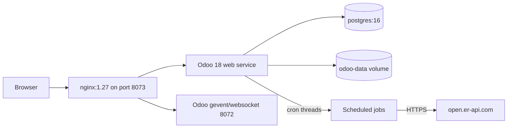
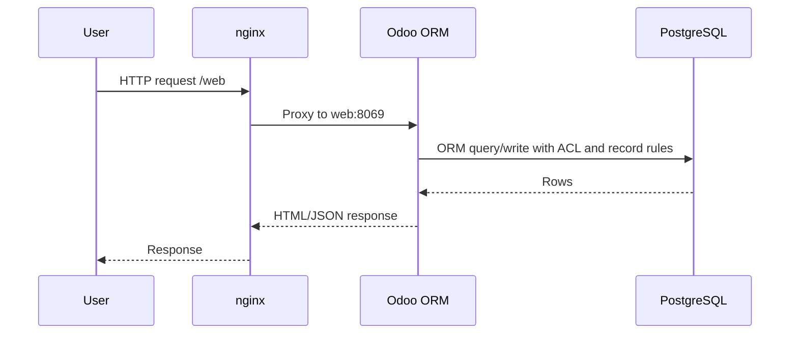
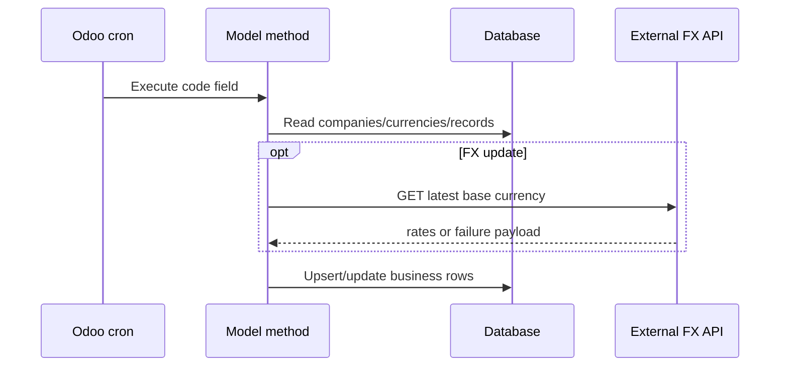

> Generated: 2026-06-12 · Commit: 11ca9f9 · Source of truth: code

# Architecture

## Logical Architecture

KIG7 is a modular Odoo addon stack. Standard Odoo provides ORM, security, views, mail/threading, HR, leaves, contracts, expenses, accounting, and cron. OCA `payroll` provides payslip structures/rules/runs. KIG7 custom addons layer UAE HR master data, custom workflows, dashboards, XLSX I/O, role isolation, multicurrency payroll, and FX-rate automation.

## Deployment Architecture

Sources: [../../../docker-compose.yml](../../../docker-compose.yml), [../../../deploy/nginx-odoo.conf](../../../deploy/nginx-odoo.conf), [../../../configs/docker.odoo.conf](../../../configs/docker.odoo.conf).

## Request Flow

## Background Job Flow

## Extension Patterns

- `_inherit` extends standard and custom Odoo models across HR, payroll, currency, users, and dashboards.
- `fields.Monetary(currency_field="contract_currency_id")` makes foreign contract fields currency-aware.
- `HrUaeFxContract` proxy is injected into `hr.payslip._compute_payslip_line` so salary rules read converted company-currency amounts at `date_to`.
- `hr.uae.audit.mixin` captures tracked HR model changes unless context disables audit.
- Versioned migration `hr_uae_base/migrations/18.0.1.1.0/post-migration.py` converges existing DBs to USD.
- `noupdate` data seeds predefined users and payroll rules; upgrades do not overwrite those records unless explicit commands clear/write fields.
- Global conditional `ir.rule` records deny Discuss/Calendar/Website data for KIG7 roles because group rules are OR-ed in Odoo.

## Risks And Tech Debt

- Inferred: overriding `_compute_payslip_line` is high-impact because every salary rule evaluation passes through it.
- Inferred: view XPath customizations can break on upstream Odoo/OCA view changes.
- Inferred: vendored OCA payroll must remain compatible with Odoo 18 Community and KIG7 inherited methods.
- Recommendation: treat rate semantics and USD company-currency migration as release-blocking test areas.
