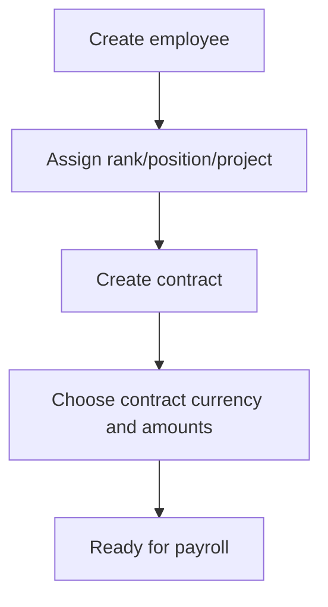
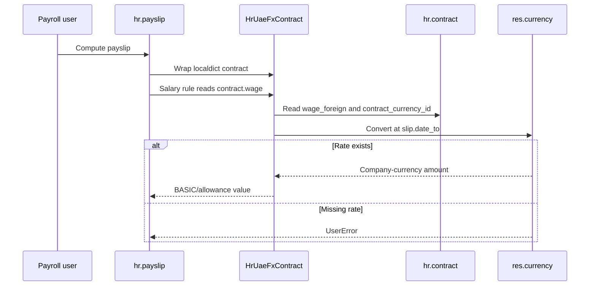
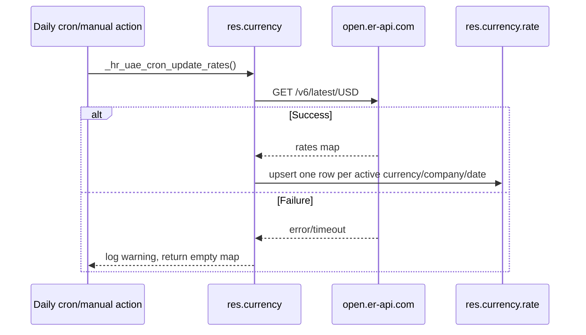

> Generated: 2026-06-12 · Commit: 11ca9f9 · Source of truth: code

# Business Workflows

## Onboarding

Trigger: HR creates or imports an employee and contract. Actors: HR Officer, HR Manager. States: employee active; contract draft/open per Odoo/OCA. Validations come from standard HR plus KIG7 master data fields. Side effects: master fields feed documents, flights, payroll dashboards, and project allocation.

Sources: [../../hr_uae_master_data/models/hr_employee.py](../../hr_uae_master_data/models/hr_employee.py), [../../hr_uae_multicurrency/models/hr_contract.py](../../hr_uae_multicurrency/models/hr_contract.py).

## Contract Management

Trigger: HR Manager creates/updates a contract. Contract currency defaults to company currency. In foreign mode, `*_foreign` fields are authoritative; company-currency mirrors are derived for display/reporting. Failure: missing rate can produce `0.0` for soft display refresh but payroll conversion is strict.

## Payroll Processing

Trigger: Payroll & Accounting Manager computes payslips. Actors: payroll manager, system. Validations: payroll rules and strict exchange-rate availability. Side effects: salary rules produce BASIC, allowances, deductions, adjustments, flight deductions, NET.

## Multicurrency Conversion

Source: [../../hr_uae_multicurrency/models/hr_payslip.py](../../hr_uae_multicurrency/models/hr_payslip.py).

## Exchange-Rate Updates

Sources: [../../hr_uae_fx_rate_update/models/res_currency.py](../../hr_uae_fx_rate_update/models/res_currency.py), [../../hr_uae_fx_rate_update/data/ir_cron.xml](../../hr_uae_fx_rate_update/data/ir_cron.xml).

## Time Off

Trigger: leave request/validation in `hr.leave`. KIG7 extends leave for audit and movement tracking. Payroll unpaid leave rule deducts `(contract.wage / 30) * unpaid_days` when `worked_days.UNPAID` exists. Source: [../../hr_uae_payroll/data/hr_salary_rule_data.xml](../../hr_uae_payroll/data/hr_salary_rule_data.xml).

## Flight Tickets

Trigger: HR records a flight and books it. States: draft, booked, completed, cancelled, rescheduled. Booking creates or updates an expense; cancelling removes linked draft expense. Employee-paid booked/completed flights become payroll deductions in the period containing the deduction date.

## Salary Adjustments

Trigger: HR creates adjustment/allowance/deduction. States: draft -> to_approve -> approved -> done/refused. HR Manager approval is required. One-shot requires target payslip; range requires from/to; recurring requires from date. Source: [../../hr_uae_salary_adjustment/models/hr_uae_salary_adjustment.py](../../hr_uae_salary_adjustment/models/hr_uae_salary_adjustment.py).

## Termination/EOS

Trigger: HR activates termination. States: draft, active, closed. Activation requires employee, writes contract end dates, cancels future draft/verify/on_hold payslips, and archives/marks employee terminated. EOS calculation details are ⚠ Unverified in code surveyed here.

## Documents, Reports, Approvals

Documents compute expiry states and daily cron emails HR managers for records expiring within 90 days. Reports/dashboards are custom Odoo views/actions. XLSX import supports validation/dry-run and per-row savepoints; see [REPORTING_AND_DASHBOARDS.md](REPORTING_AND_DASHBOARDS.md).
