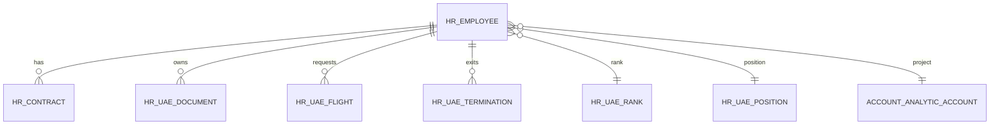
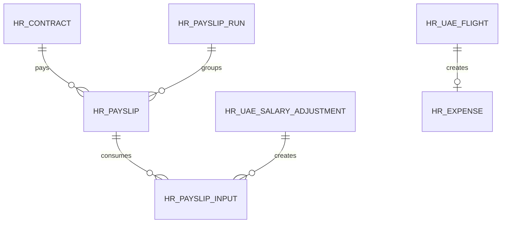
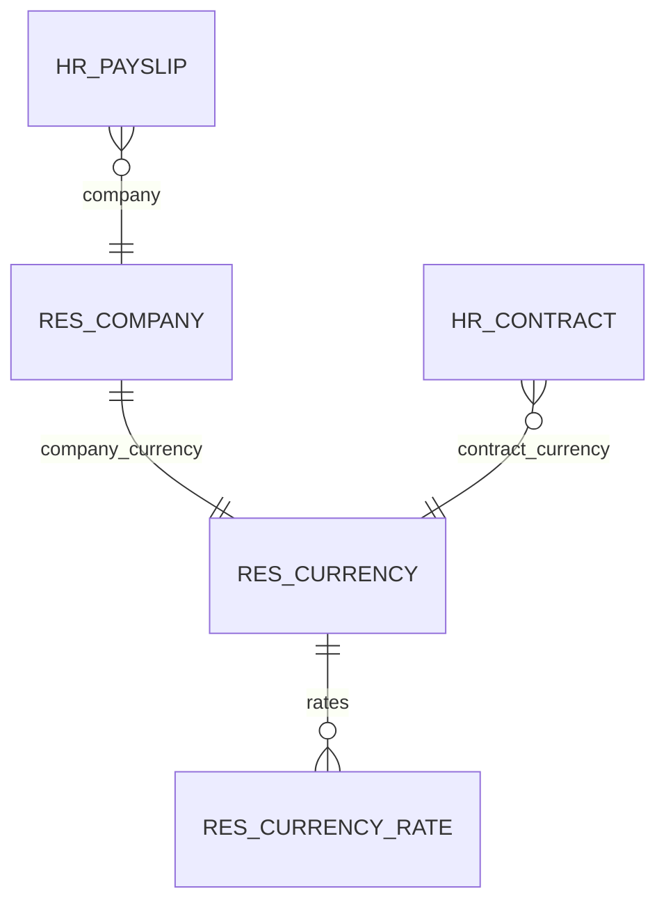

> Generated: 2026-06-12 · Commit: 11ca9f9 · Source of truth: code

# Data Model

## HR Core ERD

## Payroll And Adjustments ERD

## Currency ERD

## Major Field Tables

| Model | Important fields | Source |
|---|---|---|
| `hr.contract` | contract_currency_id, wage_foreign, housing_allowance_foreign, transportation_allowance_foreign, other_allowances_foreign, annual_ticket_amount_foreign; company-currency mirrors wage/allowances are derived. | [../../hr_uae_multicurrency/models/hr_contract.py](../../hr_uae_multicurrency/models/hr_contract.py) |
| `hr.payslip` | date_from/date_to, contract_id, inputs, worked days, state; KIG7 adds conversion proxy and flight/adjustment inputs. | [../../hr_uae_payroll/models/hr_payslip.py](../../hr_uae_payroll/models/hr_payslip.py) |
| `hr.uae.salary.adjustment` | kind, mode, amount/currency_id, target_payslip_id, date range, recurring_until, state. | [../../hr_uae_salary_adjustment/models/hr_uae_salary_adjustment.py](../../hr_uae_salary_adjustment/models/hr_uae_salary_adjustment.py) |
| `hr.uae.flight` | employee_id, payment_mode, booking_state, ticket_price, extra_charges, total, currency_id, expense_id. | [../../hr_uae_flights/models/hr_uae_flight.py](../../hr_uae_flights/models/hr_uae_flight.py) |
| `hr.uae.document` | document_type, employee_id, expiry_date, days_to_expiry, expiry_state, user_id, company_id, active. | [../../hr_uae_documents/models/hr_uae_document.py](../../hr_uae_documents/models/hr_uae_document.py) |
| `hr.uae.termination` | employee_id, contract_id, departure_date, reason, state. | [../../hr_uae_termination/models/hr_uae_termination.py](../../hr_uae_termination/models/hr_uae_termination.py) |
| `hr.uae.xlsx.template` | model_name, line_ids, active; template lines map Odoo fields to spreadsheet columns. | [../../hr_uae_xlsx_io/models/xlsx_template.py](../../hr_uae_xlsx_io/models/xlsx_template.py) |

## Inheritance Map

- `hr.employee`: master data, documents relation, payroll helpers, project allocation, audit trail.
- `hr.contract`: allowances, project fields, multicurrency fields, audit trail.
- `hr.payslip`: OCA payroll plus UAE payroll inputs, dashboards, audit trail, multicurrency proxy.
- `res.currency`: conversion helpers and online updater.
- `res.company`: UAE defaults and code-defined USD company currency.
- `res.users`: KIG7 role mutual exclusivity.

## Computed, Stored, Monetary Specifics

Contract foreign fields are authoritative and use `currency_field="contract_currency_id"`. Company-currency mirrors are derived on create/write/onchange and daily refresh. Payroll does not trust the display mirror; it reconverts foreign values at payslip `date_to` through `HrUaeFxContract`.

Document `days_to_expiry` and `expiry_state` are computed and stored. Flight `total` is computed from ticket price and extra charges. Salary adjustments create/update `hr.payslip.input` rows.

## Lifecycles And Deletion

- Documents: `active` supports archive; employee link uses `ondelete="cascade"`.
- Flights: employee/countries use restrictive links; draft linked expenses are removed when cancelling.
- Terminations: active termination writes contract end dates, cancels future draft/verify/on_hold payslips, and archives the employee.
- Adjustments: one-shot moves to done after applying; range/recurring remain approved for cron re-application.

## Multi-Company And Multicurrency

Company currency is code-defined USD. The company currency must not have `res.currency.rate` rows. Non-company currencies require rates on or before conversion dates. Multi-company security is mainly inherited from Odoo plus owner/company rules in documents and audit trail; ⚠ Unverified: full multi-company behavior for every dashboard query should be retested on a DB where a second company can be created.
