> Generated: 2026-06-12 · Commit: 11ca9f9 · Source of truth: code

# Module Dependencies

## Dependency Matrix

| Module | Depends |
|---|---|
| `hr_uae_base` | hr, hr_contract, resource |
| `hr_uae_master_data` | hr_uae_base, hr_contract, hr_holidays, analytic |
| `hr_uae_audit_trail` | hr_uae_master_data, mail |
| `hr_uae_documents` | hr_uae_master_data, hr_uae_audit_trail, mail |
| `hr_uae_flights` | hr_uae_master_data, hr_uae_audit_trail, hr_expense |
| `hr_uae_leaves` | hr_uae_master_data, hr_uae_audit_trail, hr_holidays |
| `hr_uae_payroll` | hr_uae_master_data, hr_uae_audit_trail, hr_uae_leaves, hr_uae_flights, payroll |
| `hr_uae_salary_adjustment` | hr_uae_payroll |
| `hr_uae_termination` | hr_uae_payroll |
| `hr_uae_reports` | hr_uae_master_data, hr_uae_audit_trail, hr_uae_documents, hr_uae_leaves, hr_uae_flights, hr_uae_payroll, hr_uae_salary_adjustment, hr_uae_termination |
| `hr_uae_project_department` | hr_uae_reports, hr_uae_payroll, hr_uae_flights, hr_uae_documents, hr_uae_salary_adjustment, hr_uae_termination, hr_uae_leaves, hr_contract, hr_expense, hr_holidays |
| `hr_uae_xlsx_io` | hr_uae_project_department |
| `hr_uae_multicurrency` | hr_uae_payroll, hr_uae_salary_adjustment |
| `hr_uae_fx_rate_update` | base |
| `hr_uae_access` | hr_uae_xlsx_io, calendar, website |
| `hr_uae_app` | hr_uae_base, hr_uae_master_data, hr_uae_audit_trail, hr_uae_documents, hr_uae_leaves, hr_uae_flights, hr_uae_payroll, hr_uae_salary_adjustment, hr_uae_termination, hr_uae_reports, sh_entmate_theme, rebranding, web_responsive |
| `hr_uae_backend_theme` | web, hr_uae_base |
| `thirdparty/payroll` | hr_contract, hr_holidays, mail |

## Mermaid Graph

```mermaid
flowchart LR
  classDef custom fill:#e8f3ff,stroke:#2364aa,color:#111
  classDef oca fill:#fff2cc,stroke:#a66a00,color:#111
  classDef standard fill:#eeeeee,stroke:#666,color:#111
  hr_uae_base["hr_uae_base"]:::custom
  hr_uae_master_data["hr_uae_master_data"]:::custom
  hr_uae_audit_trail["hr_uae_audit_trail"]:::custom
  hr_uae_documents["hr_uae_documents"]:::custom
  hr_uae_flights["hr_uae_flights"]:::custom
  hr_uae_leaves["hr_uae_leaves"]:::custom
  hr_uae_payroll["hr_uae_payroll"]:::custom
  hr_uae_salary_adjustment["hr_uae_salary_adjustment"]:::custom
  hr_uae_termination["hr_uae_termination"]:::custom
  hr_uae_reports["hr_uae_reports"]:::custom
  hr_uae_project_department["hr_uae_project_department"]:::custom
  hr_uae_xlsx_io["hr_uae_xlsx_io"]:::custom
  hr_uae_multicurrency["hr_uae_multicurrency"]:::custom
  hr_uae_fx_rate_update["hr_uae_fx_rate_update"]:::custom
  hr_uae_access["hr_uae_access"]:::custom
  hr_uae_app["hr_uae_app"]:::custom
  hr_uae_backend_theme["hr_uae_backend_theme"]:::custom
  thirdparty_payroll["thirdparty/payroll"]:::oca
  hr["hr"] --> hr_uae_base
  hr_contract["hr_contract"] --> hr_uae_base
  resource["resource"] --> hr_uae_base
  hr_uae_base["hr_uae_base"] --> hr_uae_master_data
  hr_contract["hr_contract"] --> hr_uae_master_data
  hr_holidays["hr_holidays"] --> hr_uae_master_data
  analytic["analytic"] --> hr_uae_master_data
  hr_uae_master_data["hr_uae_master_data"] --> hr_uae_audit_trail
  mail["mail"] --> hr_uae_audit_trail
  hr_uae_master_data["hr_uae_master_data"] --> hr_uae_documents
  hr_uae_audit_trail["hr_uae_audit_trail"] --> hr_uae_documents
  mail["mail"] --> hr_uae_documents
  hr_uae_master_data["hr_uae_master_data"] --> hr_uae_flights
  hr_uae_audit_trail["hr_uae_audit_trail"] --> hr_uae_flights
  hr_expense["hr_expense"] --> hr_uae_flights
  hr_uae_master_data["hr_uae_master_data"] --> hr_uae_leaves
  hr_uae_audit_trail["hr_uae_audit_trail"] --> hr_uae_leaves
  hr_holidays["hr_holidays"] --> hr_uae_leaves
  hr_uae_master_data["hr_uae_master_data"] --> hr_uae_payroll
  hr_uae_audit_trail["hr_uae_audit_trail"] --> hr_uae_payroll
  hr_uae_leaves["hr_uae_leaves"] --> hr_uae_payroll
  hr_uae_flights["hr_uae_flights"] --> hr_uae_payroll
  thirdparty_payroll["payroll"] --> hr_uae_payroll
  hr_uae_payroll["hr_uae_payroll"] --> hr_uae_salary_adjustment
  hr_uae_payroll["hr_uae_payroll"] --> hr_uae_termination
  hr_uae_master_data["hr_uae_master_data"] --> hr_uae_reports
  hr_uae_audit_trail["hr_uae_audit_trail"] --> hr_uae_reports
  hr_uae_documents["hr_uae_documents"] --> hr_uae_reports
  hr_uae_leaves["hr_uae_leaves"] --> hr_uae_reports
  hr_uae_flights["hr_uae_flights"] --> hr_uae_reports
  hr_uae_payroll["hr_uae_payroll"] --> hr_uae_reports
  hr_uae_salary_adjustment["hr_uae_salary_adjustment"] --> hr_uae_reports
  hr_uae_termination["hr_uae_termination"] --> hr_uae_reports
  hr_uae_reports["hr_uae_reports"] --> hr_uae_project_department
  hr_uae_payroll["hr_uae_payroll"] --> hr_uae_project_department
  hr_uae_flights["hr_uae_flights"] --> hr_uae_project_department
  hr_uae_documents["hr_uae_documents"] --> hr_uae_project_department
  hr_uae_salary_adjustment["hr_uae_salary_adjustment"] --> hr_uae_project_department
  hr_uae_termination["hr_uae_termination"] --> hr_uae_project_department
  hr_uae_leaves["hr_uae_leaves"] --> hr_uae_project_department
  hr_contract["hr_contract"] --> hr_uae_project_department
  hr_expense["hr_expense"] --> hr_uae_project_department
  hr_holidays["hr_holidays"] --> hr_uae_project_department
  hr_uae_project_department["hr_uae_project_department"] --> hr_uae_xlsx_io
  hr_uae_payroll["hr_uae_payroll"] --> hr_uae_multicurrency
  hr_uae_salary_adjustment["hr_uae_salary_adjustment"] --> hr_uae_multicurrency
  base["base"] --> hr_uae_fx_rate_update
  hr_uae_xlsx_io["hr_uae_xlsx_io"] --> hr_uae_access
  calendar["calendar"] --> hr_uae_access
  website["website"] --> hr_uae_access
  hr_uae_base["hr_uae_base"] --> hr_uae_app
  hr_uae_master_data["hr_uae_master_data"] --> hr_uae_app
  hr_uae_audit_trail["hr_uae_audit_trail"] --> hr_uae_app
  hr_uae_documents["hr_uae_documents"] --> hr_uae_app
  hr_uae_leaves["hr_uae_leaves"] --> hr_uae_app
  hr_uae_flights["hr_uae_flights"] --> hr_uae_app
  hr_uae_payroll["hr_uae_payroll"] --> hr_uae_app
  hr_uae_salary_adjustment["hr_uae_salary_adjustment"] --> hr_uae_app
  hr_uae_termination["hr_uae_termination"] --> hr_uae_app
  hr_uae_reports["hr_uae_reports"] --> hr_uae_app
  sh_entmate_theme["sh_entmate_theme"] --> hr_uae_app
  rebranding["rebranding"] --> hr_uae_app
  web_responsive["web_responsive"] --> hr_uae_app
  web["web"] --> hr_uae_backend_theme
  hr_uae_base["hr_uae_base"] --> hr_uae_backend_theme
  hr_contract["hr_contract"] --> thirdparty_payroll
  hr_holidays["hr_holidays"] --> thirdparty_payroll
  mail["mail"] --> thirdparty_payroll
  analytic:::standard
  base:::standard
  calendar:::standard
  hr:::standard
  hr_contract:::standard
  hr_expense:::standard
  hr_holidays:::standard
  mail:::standard
  rebranding:::standard
  resource:::standard
  sh_entmate_theme:::standard
  web:::standard
  web_responsive:::standard
  website:::standard
  thirdparty_payroll:::oca
```

## Circular Dependency Check

No circular dependency was found among the 17 custom modules when reading manifest `depends`. `hr_uae_app` aggregates the stack but is not depended on by the custom modules.

## Topological Install/Upgrade Order

1. Standard/OCA prerequisites: Odoo base HR apps, `thirdparty/payroll`, themes as needed.
2. `hr_uae_base`
3. `hr_uae_master_data`
4. `hr_uae_audit_trail`
5. `hr_uae_documents`, `hr_uae_flights`, `hr_uae_leaves`
6. `hr_uae_payroll`
7. `hr_uae_salary_adjustment`, `hr_uae_termination`
8. `hr_uae_reports`
9. `hr_uae_project_department`
10. `hr_uae_xlsx_io`
11. `hr_uae_multicurrency`, `hr_uae_fx_rate_update`
12. `hr_uae_access`
13. `hr_uae_app`, `hr_uae_backend_theme` as packaging/theme layers.
