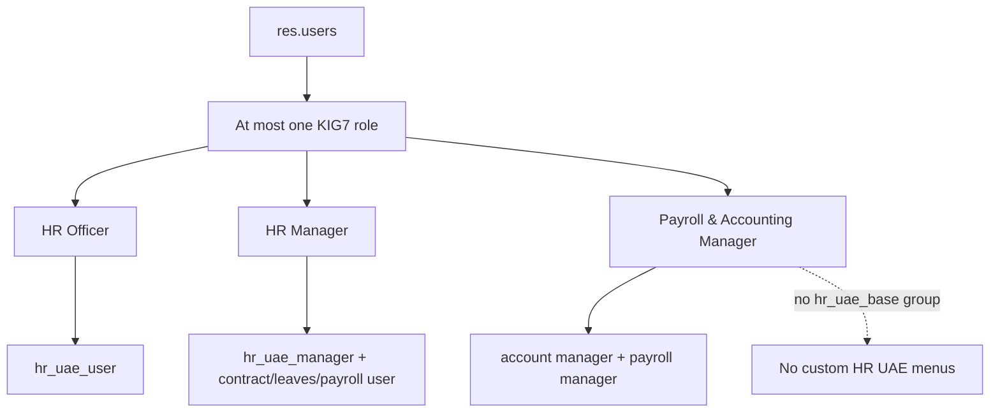

> Generated: 2026-06-12 · Commit: 11ca9f9 · Source of truth: code

# Security Architecture

## Role Model

KIG7 defines three mutually exclusive roles in category `KIG7 Access Rights`: HR Officer, HR Manager, and Payroll & Accounting Manager. A `res.users` constraint enforces at most one. Admins use standard Odoo administration groups.

Sources: [../../hr_uae_access/security/hr_uae_access_security.xml](../../hr_uae_access/security/hr_uae_access_security.xml), [../../hr_uae_access/models/res_users.py](../../hr_uae_access/models/res_users.py).

## Access Matrix

Cells are derived from KIG7 ACL CSVs, implied groups, and explicit deny rules. Standard Odoo implied access can add rights; verify in a live DB before changing production roles.

| Model / area | HR Officer | HR Manager | Payroll & Accounting Manager | Admin |
|---|---|---|---|---|
| `hr.employee` | R/W/C/U | R/W/C/U | R | R/W/C/U |
| `hr.contract` | R | R/W/C/U | R/W | R/W/C/U |
| `hr.payslip` | R | R | R/W/C/U | R/W/C/U |
| `hr.uae.document` | R/W/C/U scoped | R/W/C/U | ✗ via no menu/custom group | R/W/C/U |
| `hr.uae.flight` | R/W/C/U | R/W/C/U | ✗ via no menu/custom group | R/W/C/U |
| `hr.uae.salary.adjustment` | R/W/C | R/W/C/U/approve | ✗ via no menu/custom group | R/W/C/U |
| `hr.uae.termination` | R/W/C | R/W/C/U | ✗ via no menu/custom group | R/W/C/U |
| `hr.uae.dashboard` | R | R | ✗ | R/W/C/U |
| `hr.uae.xlsx.template` | R/export/import as granted | R/W/C/U | ✗ | R/W/C/U |
| `res.currency.rate` | ✗ | R/config as inherited | R/accounting as inherited | R/W/C/U |
| `ir.config_parameter` | ✗ | ✗ | ✗ | R/W/C/U |
| `discuss.channel` | ✗ global deny | ✗ global deny | ✗ global deny | standard/admin |
| `calendar.event` | ✗ global deny | ✗ global deny | ✗ global deny | standard/admin |
| `website.page` | ✗ global deny + standard internal ACL limits | ✗ global deny | ✗ global deny | standard/admin |

## Groups And Implied Groups

- HR Officer implies `base.group_user`, `hr.group_hr_user`, `hr_holidays.group_hr_holidays_user`, `hr_uae_base.group_hr_uae_user`.
- HR Manager implies `base.group_user`, `hr_uae_base.group_hr_uae_manager`, `hr_contract.group_hr_contract_manager`, `hr_holidays.group_hr_holidays_manager`, `payroll.group_payroll_user`.
- Payroll & Accounting Manager implies `base.group_user`, `account.group_account_manager`, `hr_expense.group_hr_expense_manager`, `payroll.group_payroll_manager`, `hr.group_hr_user`, `hr_contract.group_hr_contract_manager`.

## Menu Visibility Vs Model Security

Menu restrictions hide Discuss, Calendar, and Website root/configuration menus from non-admins. Model security still matters because users can reach records through URLs/RPC. Therefore KIG7 also defines global deny `ir.rule` records for `discuss.channel`, `calendar.event`, and `website.page`.

## Rule Inventory

- `rule_kig7_block_discuss_channel`: global conditional deny for KIG7 roles.
- `rule_kig7_block_calendar_event`: global conditional deny for KIG7 roles.
- `rule_kig7_block_website_page`: global conditional deny for KIG7 roles.
- Document/audit rules scope records by owner/company in their modules. Source: [../../hr_uae_documents/security/hr_uae_documents_security.xml](../../hr_uae_documents/security/hr_uae_documents_security.xml) and audit security files.

Global is required because Odoo ANDs global rules with all access while group rules are OR-ed.

## Sensitive Data Inventory

- Predefined users exist in `hr_uae_access/data/res_users_data.xml` with default credentials. Do not print them; rotate before production.
- Payroll amounts, contract salaries, passport/visa/document attachments, audit logs, and expense data are sensitive.
- Deployment secrets must use placeholders such as `${POSTGRES_PASSWORD}`; do not commit real values.

## Gaps And Recommendations

- Recommendation: rotate default KIG7 user passwords before production.
- Recommendation: retest menu restrictions after upgrading mail/calendar/website because restrictions re-apply only when `hr_uae_access` updates.
- Recommendation: review chatter followers/attachments for sensitive HR records.
