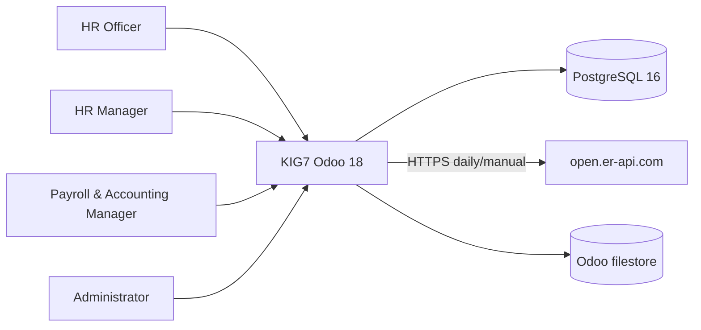

> Generated: 2026-06-12 · Commit: 11ca9f9 · Source of truth: code

# System Overview

## Business Purpose

KIG7 supports UAE HR operations in Odoo 18 Community: employee master data, contract allowances, leaves, documents, flights, salary adjustments, payroll, termination/EOS tracking, dashboards, XLSX import/export, and role-separated access.

## Stakeholders

- HR Officer: operational HR records, leaves, documents, flights, read dashboards.
- HR Manager: HR approvals, contracts, reports, configuration, payroll consultation.
- Payroll & Accounting Manager: payroll computation, accounting and expense access, deliberately outside custom HR UAE menu groups.
- Administrator: platform configuration, module upgrades, user/group maintenance, restricted apps.
- System/Cron: scheduled FX updates, contract currency display refreshes, document alerts, recurring adjustments.

## Boundaries

In scope: custom Odoo addons under `HrProject/hr_uae_*`, vendored OCA payroll, Docker Compose deployment, and the open.er-api.com FX integration.

Out of scope: custom mobile apps, external identity provider, external payroll bank transfer integration, and custom messaging/calendar/website workflows. Those apps are blocked or admin-only for KIG7 roles.

## Standard vs Custom

| Area | Standard/OCA | KIG7 custom behavior | Source |
|---|---|---|---|
| Payroll engine | OCA `payroll` | UAE salary rules, inputs, dashboards, conversion proxy | [../../hr_uae_payroll/data/hr_salary_rule_data.xml](../../hr_uae_payroll/data/hr_salary_rule_data.xml), [../../hr_uae_multicurrency/models/hr_payslip.py](../../hr_uae_multicurrency/models/hr_payslip.py) |
| Employees/contracts | Odoo HR, HR Contract | UAE master fields, project allocation, foreign contract currency fields | [../../hr_uae_master_data/models/hr_employee.py](../../hr_uae_master_data/models/hr_employee.py), [../../hr_uae_multicurrency/models/hr_contract.py](../../hr_uae_multicurrency/models/hr_contract.py) |
| Security | Odoo groups, ACLs, rules | Three exclusive KIG7 roles, global deny rules | [../../hr_uae_access/security/hr_uae_access_security.xml](../../hr_uae_access/security/hr_uae_access_security.xml) |
| Currency rates | Odoo currencies | Online daily updater and strict missing-rate failures in payroll | [../../hr_uae_fx_rate_update/models/res_currency.py](../../hr_uae_fx_rate_update/models/res_currency.py) |
| Deployment | Docker/Odoo/Postgres/nginx | Compose topology and mounted addons/config | [../../../docker-compose.yml](../../../docker-compose.yml) |

## System Context

## External Integration

Verified external business integration: open.er-api.com for FX rates. Authentication is none; timeout is 20 seconds; failures are logged and return `{}` without raising in the updater. Source: [../../hr_uae_fx_rate_update/models/res_currency.py](../../hr_uae_fx_rate_update/models/res_currency.py).
