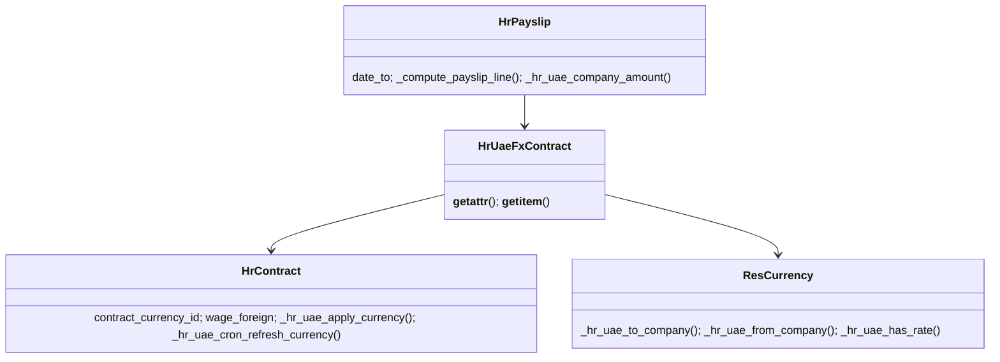
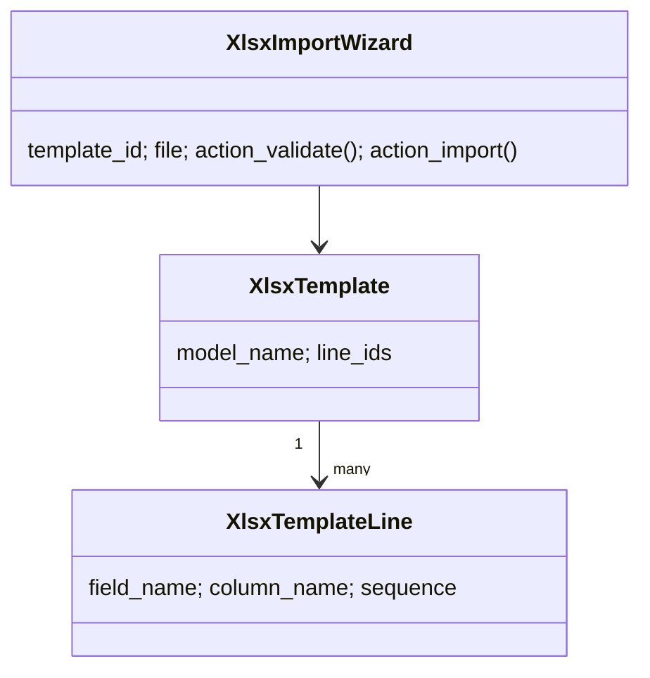
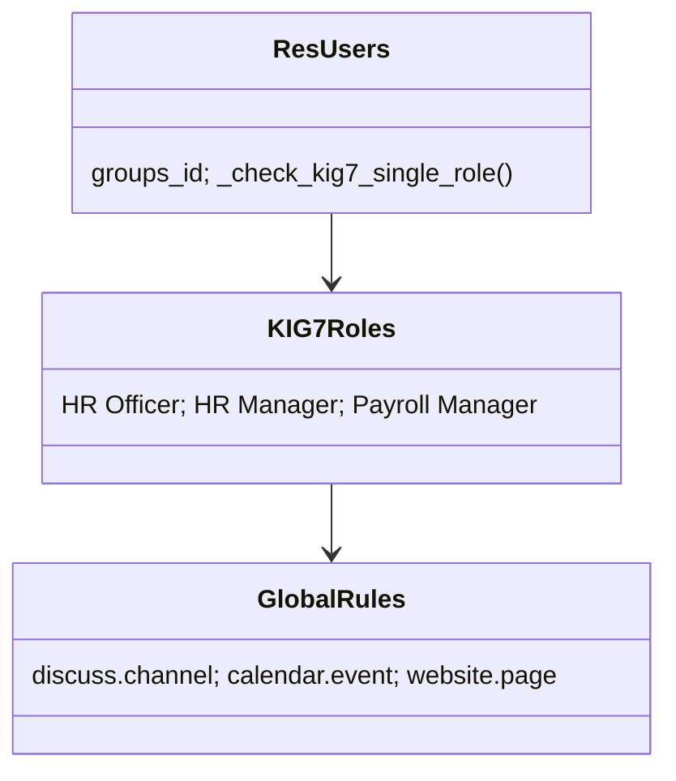
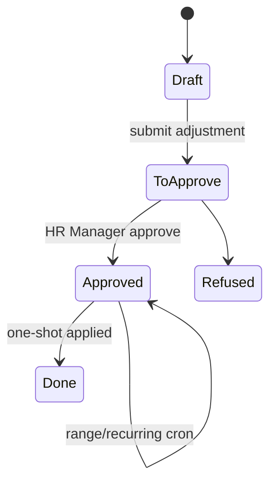
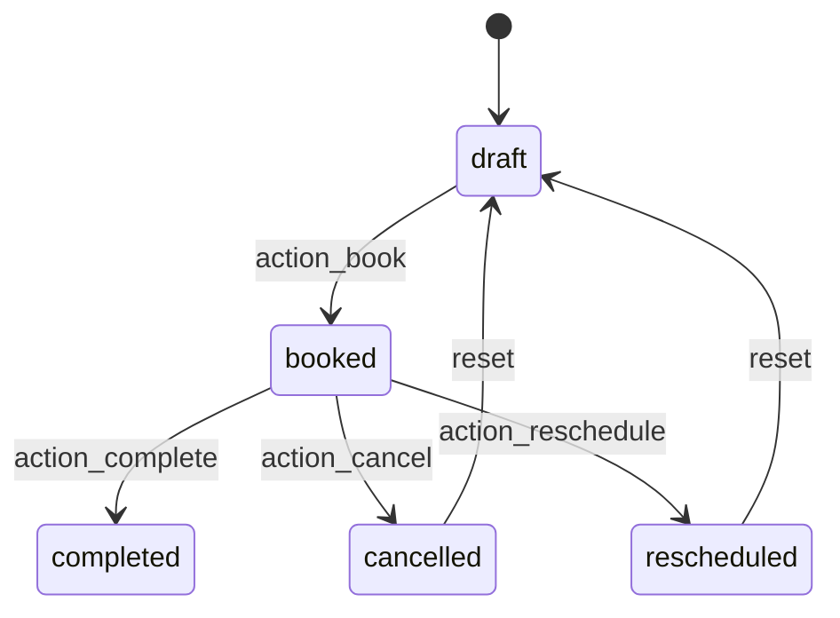
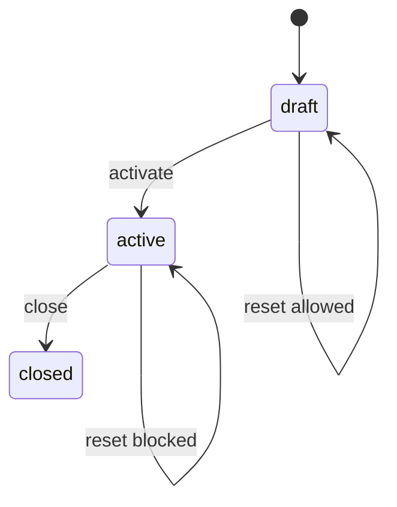
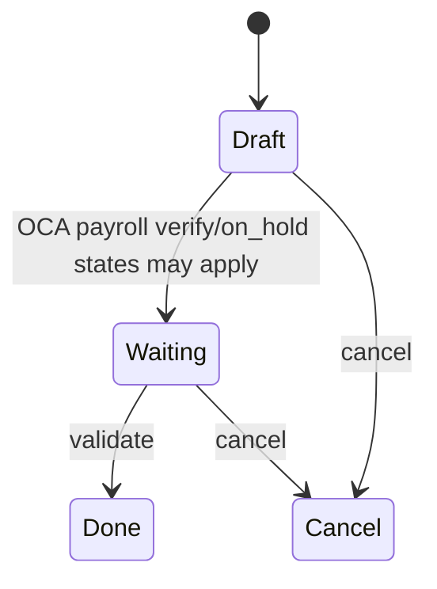
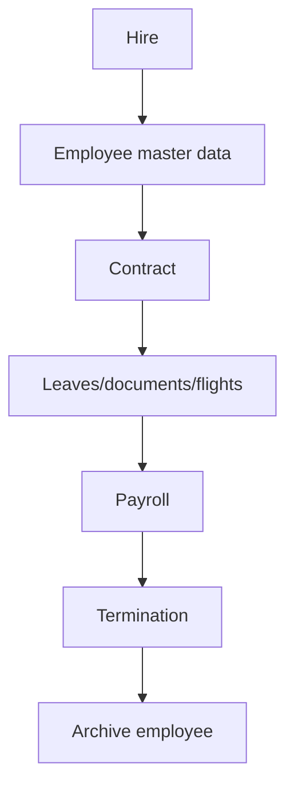
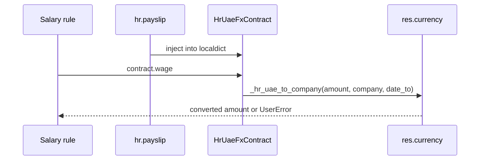
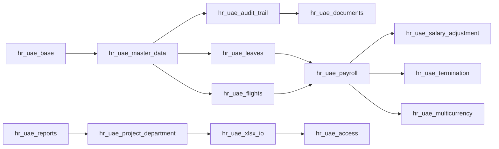

> Generated: 2026-06-12 · Commit: 11ca9f9 · Source of truth: code

# UML Diagrams

## Multicurrency Class Diagram

## XLSX Class Diagram

## Access Domain Diagram

## State Diagrams

⚠ Unverified: exact OCA payslip state labels should be checked against the installed `thirdparty/payroll` views/model when changing payroll workflow.

## Employee Lifecycle Activity

## Payslip Compute With Conversion

## Package Diagram

