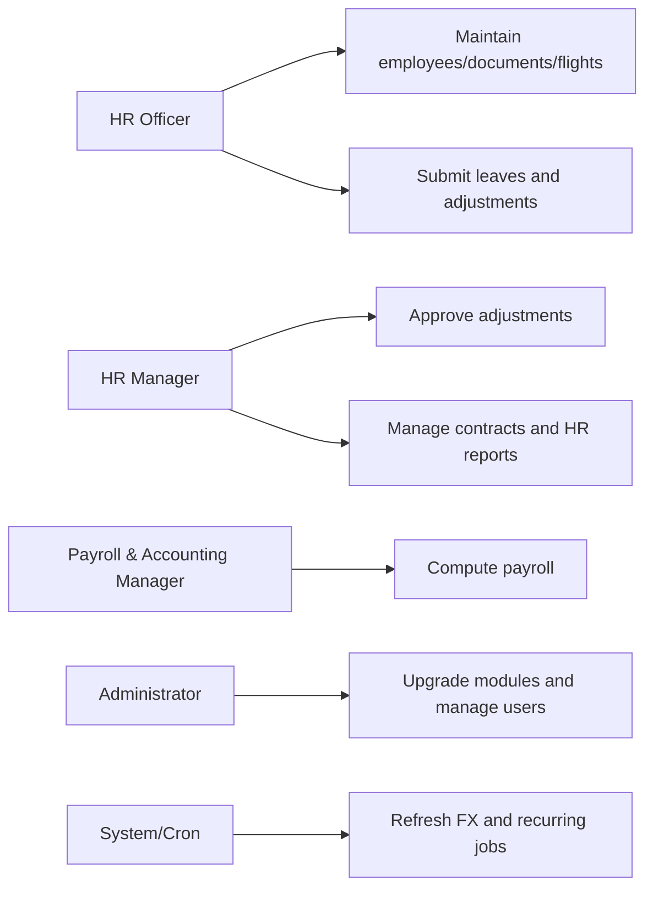

> Generated: 2026-06-12 · Commit: 11ca9f9 · Source of truth: code

# Use Cases

## Actors

- HR Officer
- HR Manager
- Payroll & Accounting Manager
- Administrator
- System/Cron

## Use-Case Diagrams

## Main Scenarios

| Use case | Main flow | Alternate/failure | Precondition | Postcondition |
|---|---|---|---|---|
| Onboarding | Create employee, assign master data, create contract | Missing required standard HR fields blocks save | HR access | Employee and contract exist |
| Contract management | Select contract currency and enter foreign amounts | Missing rate affects display refresh or payroll | Contract exists | Mirrors updated |
| Payroll run | Generate payslip, compute rules, validate | Missing FX rate raises UserError | Contract and rates exist | Payslip lines computed |
| Adjustments | Draft, submit, approve, apply to payslip input | Wrong state/role/missing dates raises UserError | Target payslip/range exists | Input rows created |
| Flights | Create flight, book, expense sync | Missing employee/product raises UserError | Employee exists | Flight booked and expense linked |
| Leaves | Standard leave flow, unpaid worked days feed payroll | ⚠ Unverified: exact leave approval matrix inherited from Odoo | Leave type exists | Leave affects worked days |
| Termination | Activate termination | No employee raises UserError; active cannot reset to draft | Employee exists | Contracts ended, future slips cancelled, employee archived |
| Documents | Create document with expiry | No template means cron returns without email | Employee exists | Expiry state computed, alerts possible |
| XLSX I/O | Select template, validate/import/export | Row errors produce validation/error workbook behavior | Template exists | Records imported/exported |
| Access roles | Assign exactly one role | Multiple roles raise ValidationError | Admin manages user | User has isolated menu/model access |

## Traceability

| Use case | Module | Model | Test file |
|---|---|---|---|
| Onboarding | hr_uae_master_data | hr.employee, hr.contract | hr_uae_master_data/tests/test_master_data.py |
| Contract management | hr_uae_multicurrency | hr.contract | hr_uae_multicurrency/tests/test_multicurrency.py |
| Payroll run | hr_uae_payroll, hr_uae_multicurrency | hr.payslip | hr_uae_payroll/tests/test_payroll.py |
| Adjustments | hr_uae_salary_adjustment | hr.uae.salary.adjustment | hr_uae_salary_adjustment/tests/test_salary_adjustment.py |
| Flights | hr_uae_flights | hr.uae.flight | hr_uae_flights/tests/test_flights.py |
| Leaves | hr_uae_leaves | hr.leave | hr_uae_leaves/tests/test_leaves.py |
| Termination | hr_uae_termination | hr.uae.termination | hr_uae_termination/tests/test_termination.py |
| Documents | hr_uae_documents | hr.uae.document | hr_uae_documents/tests/test_documents.py |
| Dashboards/reports | hr_uae_reports, hr_uae_payroll | hr.uae.dashboard | hr_uae_reports/tests/test_reports.py |
| XLSX I/O | hr_uae_xlsx_io | hr.uae.xlsx.template | hr_uae_xlsx_io/tests/test_xlsx_io.py |
| Access roles | hr_uae_access | res.users, ir.rule | hr_uae_access/tests/*.py |
