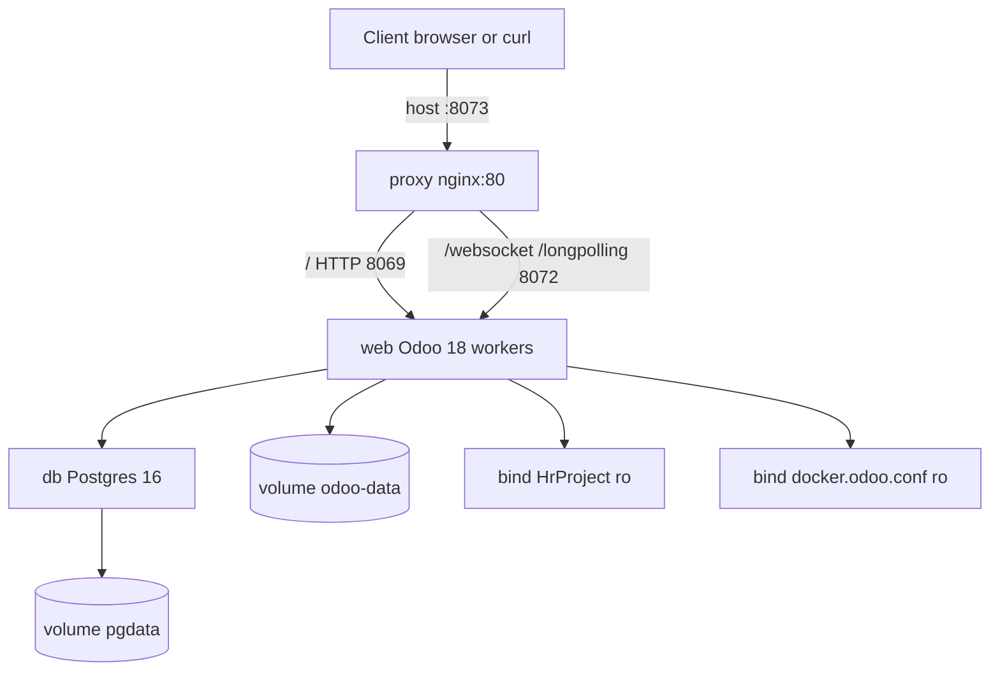

# KIG7 — Technical service reference (Docker / Odoo 18)

Infrastructure and operations for the staging stack. For VPS provisioning and Git credentials, see [`VPS_RUNBOOK.md`](VPS_RUNBOOK.md). For secrets policy, see [`SECURITY.md`](SECURITY.md).

---

## Architecture



| Service | Image / build | Role |
|---------|---------------|------|
| `db` | `postgres:16` | PostgreSQL; data in named volume `pgdata` |
| `web` | `kig7-odoo18-web:18.0` from `deploy/Dockerfile` | Odoo application (multi-worker) |
| `proxy` | `nginx:1.27-alpine` | Reverse proxy; only service publishing a host port |

Odoo **does not** bind host ports directly. External access is via `proxy` on `${ODOO_PUBLISH_PORT:-8073}:80`.

---

## Network and ports

| Location | Port | Protocol | Purpose |
|----------|------|----------|---------|
| Host | `8073` (default, `.env`) | HTTP | Nginx front door |
| `web` (internal) | `8069` | HTTP | Odoo HTTP workers (`http_port`) |
| `web` (internal) | `8072` | HTTP | Gevent / longpolling / websocket (`gevent_port`) |
| `db` (internal) | `5432` | TCP | PostgreSQL (not exposed on host) |

Nginx routing ([`nginx-odoo.conf`](nginx-odoo.conf)):

- `/` → `web:8069`
- `/websocket` → `web:8072` (Upgrade headers)
- `/longpolling/` → `web:8072`
- `client_max_body_size` 200m; proxy timeouts 7200s

**Requirement:** `workers > 0` in Odoo config **requires** this proxy split. Do not publish `8069` on the host without equivalent websocket routing.

---

## Volumes and bind mounts

| Mount | Type | Container path | Notes |
|-------|------|----------------|-------|
| `pgdata` | named volume | `/var/lib/postgresql/data` | Survives `docker compose down` (not `-v`) |
| `odoo-data` | named volume | `/var/lib/odoo` | Filestore: `/var/lib/odoo/filestore/<db_name>/` |
| `./HrProject` | bind (ro) | `/mnt/kig7-addons` | Custom addons + `thirdparty` + `design-themes` |
| `./configs/docker.odoo.conf` | bind (ro) | `/etc/odoo/odoo.conf` | Odoo runtime config |
| `./deploy/nginx-odoo.conf` | bind (ro) | `/etc/nginx/conf.d/default.conf` | Proxy only |

**Addons path** (in `docker.odoo.conf`):

```ini
addons_path = /usr/lib/python3/dist-packages/odoo/addons,/mnt/kig7-addons,/mnt/kig7-addons/thirdparty,/mnt/kig7-addons/thirdparty/design-themes
```

Code changes under `HrProject/` apply after **module upgrade** or Odoo restart; no image rebuild required for Python/XML-only changes. Rebuild `web` when `deploy/Dockerfile` changes.

---

## Configuration

### `.env` (Compose / Postgres only)

Copy from [`.env.example`](../.env.example):

| Variable | Default | Used by |
|----------|---------|---------|
| `POSTGRES_USER` | `odoo` | `db` service |
| `POSTGRES_PASSWORD` | *(set on server)* | `db` service |
| `POSTGRES_DB` | `postgres` | `db` service bootstrap DB |
| `ODOO_PUBLISH_PORT` | `8073` | `proxy` host port mapping |

### `configs/docker.odoo.conf` (Odoo / web)

| Setting | Staging value | Notes |
|---------|---------------|-------|
| `db_host` | `db` | Docker Compose DNS name |
| `db_user` | `odoo` | Must match Postgres role |
| `db_password` | *(must match `POSTGRES_PASSWORD`)* | **Critical:** mismatch → `password authentication failed for user "odoo"` |
| `db_name` | `18c_hr_project_test` | Application database |
| `data_dir` | `/var/lib/odoo` | On `odoo-data` volume |
| `workers` | `8` | Multi-process mode |
| `max_cron_threads` | `2` | |
| `limit_time_cpu` / `limit_time_real` | `600` / `1200` | Long reports/upgrades |
| `limit_memory_soft` / `hard` | 2 GiB / 2.5 GiB | Per worker |
| `http_port` / `gevent_port` | `8069` / `8072` | Must match nginx upstreams |
| `admin_passwd` | *(server secret)* | Odoo database manager master password |

Never commit production passwords. Keep `.env` gitignored.

---

## Resource limits (Compose)

| Service | CPU limit | Memory limit | Other |
|---------|-----------|--------------|-------|
| `db` | 3 | 10G | `shm_size: 6gb`; tuned `postgres` flags in `command` |
| `web` | 6 | 14G | `shm_size: 1536mb` |
| `proxy` | 1 | 256M | |

Postgres tuning (excerpt): `shared_buffers=2GB`, `max_connections=200`, `max_parallel_workers=8`, WAL sizes as in [`docker-compose.yml`](../docker-compose.yml).

---

## Web image (`deploy/Dockerfile`)

- **Base:** `odoo:18.0`
- **Adds:** `fontconfig`, `fonts-dejavu-core` (PDF/report rendering)
- **Does not** bake in `HrProject` — addons stay bind-mounted for fast iteration

```bash
docker compose build web
docker compose up -d
```

---

## Lifecycle commands

```bash
cd /opt/kig7-odoo18   # or your clone root (must contain docker-compose.yml)

docker compose up -d          # start / recreate
docker compose ps             # status
docker compose logs -f web    # Odoo logs
docker compose logs -f db     # Postgres logs
docker compose restart web proxy
docker compose stop web       # before one-shot odoo -u (see below)
```

Health check: `curl -sI "http://127.0.0.1:${ODOO_PUBLISH_PORT:-8073}/web/login"` → expect `HTTP/1.1 200 OK`.

---

## Code deploy workflow

### 1. Backup (mandatory)

```bash
bash deploy/backup-manage.sh deploy
# or combined pull:
bash deploy/deploy-staging.sh
```

`deploy-staging.sh` runs backup then `git fetch` / `checkout` / `pull` for `KIG7_GIT_BRANCH` (default `staging`).

### 2. Pull and rebuild if needed

```bash
git log -1 --oneline
docker compose build web    # if Dockerfile or base image changed
docker compose up -d
```

### 3. Module upgrade (`--stop-after-init`)

While `web` is running with `workers=8`, port `8069` is already bound. **Do not** use `docker compose exec web odoo -u ...` on a live container — it fails with `Address already in use`.

**Correct pattern:**

```bash
docker compose stop web
docker compose run --rm -T web odoo -c /etc/odoo/odoo.conf \
  -u module_a,module_b \
  -d 18c_hr_project_test --stop-after-init
docker compose up -d web
docker compose restart proxy
```

Replace `module_a,module_b` with the comma-separated modules for your release. Exit code must be `0`.

### 4. Smoke test

```bash
sleep 20
curl -sI "http://127.0.0.1:${ODOO_PUBLISH_PORT:-8073}/web/login" | head -5
docker compose logs web --tail 50
```

---

## Backup management (no restore)

Online backups with **no service stop**. Storage: `/var/backups/kig7-odoo18/` (outside git, mode `0700`).

### Layout

```
/var/backups/kig7-odoo18/
  sets/
    20260516T161047Z-daily/
      db.dump           # pg_dump -Fc
      filestore.tgz     # tar of filestore/<db_name>/
      manifest.json     # trigger, git commit, sizes, timestamp
  logs/
    backup-manage.log
  .backup.lock          # flock — one run at a time
```

### Scripts

| Script | Purpose |
|--------|---------|
| [`backup-manage.sh`](backup-manage.sh) | Main entry: backup + retention |
| [`backup-retention.sh`](backup-retention.sh) | Delete sets older than 7 days; **always keep newest** |
| [`backup-lib.sh`](backup-lib.sh) | Shared helpers (sourced) |
| [`deploy-staging.sh`](deploy-staging.sh) | `deploy` backup + `git pull` |

```bash
bash deploy/backup-manage.sh daily          # manual / scheduled
bash deploy/backup-manage.sh deploy         # pre-deploy
bash deploy/backup-manage.sh cleanup-only   # retention only
bash deploy/backup-manage.sh backup-only [tag]
```

| Step | Implementation |
|------|----------------|
| Database | `docker compose exec -T db pg_dump -U odoo -Fc <db_name>` |
| Filestore | `docker compose exec -T web tar -czf - -C /var/lib/odoo/filestore <db_name>` |
| Lock | `flock` on `/var/backups/kig7-odoo18/.backup.lock` |
| Exit codes | `0` ok, `1` failure, `2` lock held |

Environment overrides: `KIG7_BACKUP_ROOT`, `KIG7_RETENTION_DAYS` (default `7`), `KIG7_MIN_FREE_MB` (warn below 2048).

### Systemd timer (05:00 UTC)

```bash
sudo cp deploy/systemd/kig7-odoo18-backup.{service,timer} /etc/systemd/system/
sudo systemctl daemon-reload
sudo systemctl enable --now kig7-odoo18-backup.timer
sudo systemctl start kig7-odoo18-backup.timer   # if timer shows inactive until started
systemctl list-timers kig7-odoo18-backup.timer
```

- **Service:** `Type=oneshot`, `WorkingDirectory=/opt/kig7-odoo18`, runs `backup-manage.sh daily`
- **Timer:** `OnCalendar=*-*-* 05:00:00 UTC` (older systemd: UTC suffix on calendar line, not `Timezone=`)

Logs: `/var/backups/kig7-odoo18/logs/backup-manage.log`, `journalctl -u kig7-odoo18-backup.service`.

**These scripts do not restore.** For disaster recovery, copy artifacts into `deploy/artifacts/` and use restore scripts below.

---

## Restore (manual)

### From automated backup set

```bash
cp /var/backups/kig7-odoo18/sets/<latest>/db.dump deploy/artifacts/kig7_18c_hr_project_test.dump
cp /var/backups/kig7-odoo18/sets/<latest>/filestore.tgz deploy/artifacts/kig7_filestore_18c_hr_project_test.tgz
docker compose stop web
bash deploy/restore.sh
docker compose up -d
```

### From Odoo UI `.zip` (`dump.sql` + `filestore/`)

Place zip under `deploy/artifacts/` (committed seed: `18c_hr_project_test_2026-05-13_03-21-27.zip` for initial VPS clone only).

```bash
docker compose pull db
docker compose build web
bash deploy/restore_from_odoo_zip.sh
```

### From `pg_dump` + `.tgz` in `deploy/artifacts/`

```bash
bash deploy/restore.sh
```

`restore.sh` drops and recreates `18c_hr_project_test`, restores dump, extracts filestore into `odoo-data` volume, restarts `web`.

**Warning:** `docker compose down -v` destroys `pgdata` and `odoo-data`. Do not use for routine deploys.

---

## Repository layout (operations-relevant)

```
/opt/kig7-odoo18/
  docker-compose.yml
  .env                    # gitignored — Postgres + publish port
  configs/docker.odoo.conf
  HrProject/              # bind-mounted addons (not in web image)
  deploy/
    Dockerfile
    nginx-odoo.conf
    backup-*.sh
    deploy-staging.sh
    restore.sh
    restore_from_odoo_zip.sh
    systemd/
    artifacts/            # restore inputs; *.dump/*.tgz gitignored
```

---

## Troubleshooting

| Symptom | Likely cause | Action |
|---------|--------------|--------|
| `502` on login URL | `web` down or still starting | `docker compose ps`; `docker compose logs web` |
| `password authentication failed for user "odoo"` | `POSTGRES_PASSWORD` ≠ `db_password` in `docker.odoo.conf` | Align both; **do not** `docker compose down -v` |
| `Address already in use` on `odoo -u` | Upgrade run inside live `web` container | `docker compose stop web` then `docker compose run --rm web odoo ...` |
| Websocket / bus errors in UI | Nginx not routing `/websocket` | Confirm `proxy` service up; `workers > 0` requires proxy |
| Backup lock error | Overlapping backup runs | Wait or remove stale lock only if no backup process running |
| Empty `db.dump` | DB down or wrong `db_name` | Check `docker compose exec db pg_isready -U odoo` |

### Odoo shell (diagnostics)

```bash
docker compose exec -T web odoo shell -c /etc/odoo/odoo.conf \
  -d 18c_hr_project_test --no-http
```

---

## Fresh stack (destructive)

```bash
docker compose down -v
docker compose pull db
docker compose build web
bash deploy/restore_from_odoo_zip.sh
# or: bash deploy/restore.sh
```

---

## Branches

- **`staging`** — primary integration branch for VPS
- **`phase-one-branch`** — same Docker/deploy assets; interchangeable for clone branch name

---

## Related scripts (reference)

| File | Role |
|------|------|
| [`restore.sh`](restore.sh) | `pg_restore` + filestore from `deploy/artifacts/` |
| [`restore_from_odoo_zip.sh`](restore_from_odoo_zip.sh) | Odoo export zip → DB + filestore |
| [`vps-remote-up.sh`](vps-remote-up.sh) | Workstation-driven full provision + restore |
